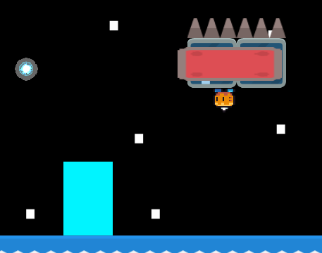
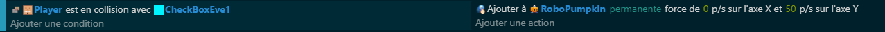

# l'Introduction des Checkboxes 🌟

## Tuer notre personnage 💀

La première étape vers une aventure pleine de frissons commence par placer des checkboxes sur chaque plateforme. Ces petites zones📍seront nos sentinelles, prêtes à déclarer notre personnage cubique 🟩 "hors jeu" lorsqu'il franchira les limites. Placez-les avec soin pour que les fins tragiques surviennent juste au bon moment, que ce soit dans un piège ⚠️ ou contre un obstacle inattendu.

### Code de la Mort 💻
Avec nos sentinelles en place, on passe à la sentence finale. Lors d'un contact fatal, le script exécutera une série d'actes : l'arrêt net du personnage, l'affichage d'une animation de mort spectaculaire 🎭, et l'apparition d'un sombre "Game Over" 🏴 sur l'écran. Cette mécanique cruelle, mais juste, punit les erreurs et amplifie le défi.

Pour garder le mystère, l'opacité des checkboxes sera réduite à néant dès le début de l'aventure 🌫️.

Dans mon petit monde, une mort entraîne une explosion 🧨 de particules rouges, une disparition tragique du joueur, et un retour rapide à la case départ pour corriger les erreurs du passé.

### Placement des Checkboxes événementielle 📦

Dans cet exemple, on placera un ennemi à pic au plafond qui tombera lorsque le player passeras une checkBox en particulier.

### Code évènement ❄️

## Défi pour l'Aventure 🌈
- Création de Checkboxes Innovantes: Envisagez des zones de détection interactives qui pourraient non seulement tuer, mais également transformer ou téléporter le personnage 🌀.
- Effets Sonores et Visuels de Mort: Personnalisez l'expérience tragique avec des effets épiques pour chaque type de fin ☠️. Laissez votre créativité s'exprimer en ajoutant des sons déchirants et des lumières apocalyptiques.
- Jumpers Magiques: Challengez vos joueurs avec des tremplins qui testent leur timing et précision. Chaque saut peut devenir une énigme 🧩, une chance de découvrir des coins cachés du jeu.

Cet enrichissement de votre cours promet un voyage rempli de rebondissements et d'émotions fortes où chaque détail compte. Plus qu'un simple jeu, c'est une odyssée de la persévérance contre la fatalité ! 🌍🎮
