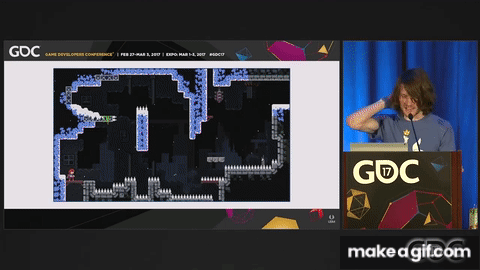

# Défi Level Design : Création d'un Monde Inoubliable 🌍🎨

Maintenant que le code de notre jeu émerge brillamment, il est grand temps de se lancer dans une aventure de création sans pareille : le level design. Cette étape est la clé de voûte qui transformera une mécanique de jeu en une odyssée captivante et immersive pour les joueurs.

## Qu'est-ce que le Level Design ? 🛠️🗺️
Le level design, ou conception de niveaux, est l'art subtil de façonner des espaces de jeu qui captivent et engagent le joueur dans une aventure. Cela va bien au-delà de simplement positionner des plateformes ou des ennemis ; c'est une réflexion plus profonde sur ce qui rend le jeu amusant, stimulant et mémorable.

## Votre Mission, si vous l'acceptez
Avec la base de code en place, votre défi est d'insuffler vie et âme dans cet univers en herbe. Il s’agit de réfléchir à la progression du joueur, à l’équilibrage des défis et à l’immersion visuelle et ludique du jeu. Voici quelques pistes pour vous lancer :

- Diversité des Environnements : 🏞️🌆 Des abysses obscures aux sommets célestes, chaque niveau doit être un nouvel éclat visuel et une aventure unique.
- Progression du Défi : 📈 Assurez que le voyage du joueur soit parsemé de défis croissants, élevés de façon fluide pour garder l’enthousiasme intact.

## Téléchargez le Projet et Lancez-Vous ! 📥
Prêt(𝑒) à conquérir l’impossible ? Commencez dès maintenant avec notre trousse à outils en téléchargeant le projet complet [GeoDashPart3.zip](https://github.com/g404-code-gaming/GeometryDashDistanciel/files/14955751/GeoDashPart3.zip)
. Ce kit de démarrage comporte tout le code essentiel, libérant votre esprit pour l'aventure créative qui vous attend.

## Inspirations et Conseils
- Explorez le monde des jeux : 🎮 La découverte d'autres univers ludiques peut ouvrir les portes de l'imagination.
- Partage et Feedback : 💬 L'échange avec d'autres créateurs peut offrir des perspectivesenrichissantes.
- Iteration : 🔁 Le secret d'un design réussi réside souvent dans le cycle essai/erreur. Lancez-vous, expérimentez et perfectionnez !

C'est le moment de laisser libre cours à votre créativité et d'oser dans vos créations. Chaque niveau est une page blanche n'attendant que vos idées. À vous de jouer ! 🚀🌈

## Liberté Créative : Exprimez-Vous 🌈✏️

Une fois votre niveau minutieusement construit, le véritable jeu commence. C'est à vous d'enrichir cet univers selon vos envies.

Quelques pistes : 

- Expérimentez : 🛠️ L'innovation n'a pas de limite. Testez de nouvelles idées !
- Personnalisez : 🖌️ Votre style peut transformer l'expérience de jeu.
- Inspirez : 🚀 Partagez vos créations, elles pourraient inspirer d'autres.

Rappelez-vous, chaque modification, grande ou petite, rend votre jeu unique. Soyez audacieux !
