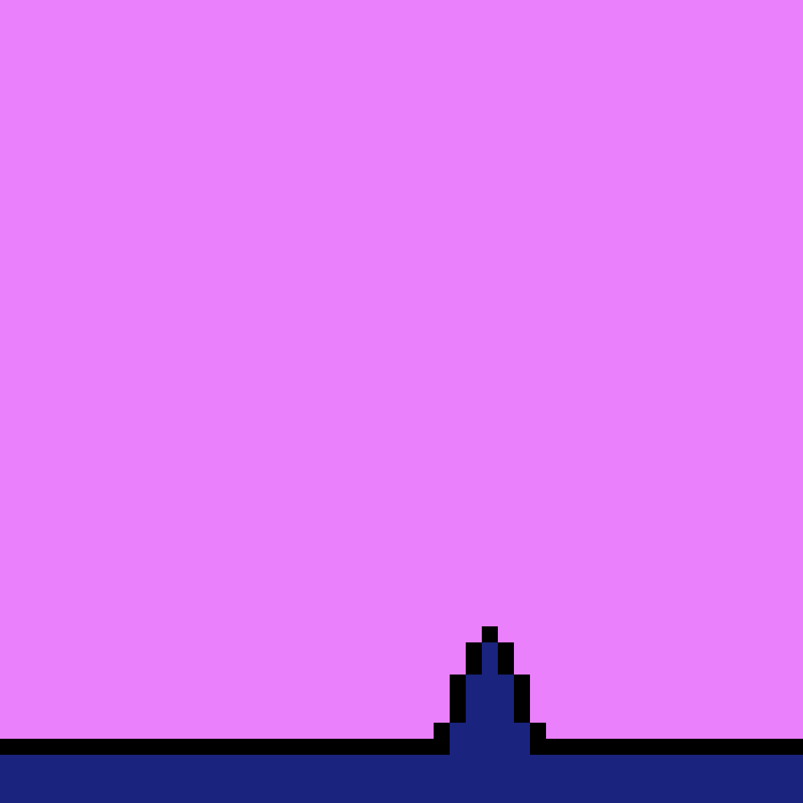

# GeometryDashDistanciel

Plongez dans le monde du développement de jeux avec notre version éducative de Geometry Dash, un défi de plateforme rythmique qui a captivé des millions 🌍. Nos jeunes développeurs CodeGaming à distance 🎮 contrôleront un cube audacieux 🟩, le guidant à travers des niveaux truffés d'obstacles. Votre mission, si vous l'acceptez, est de sauter 🦘, voler 🚀 et vous téléporter 🌀 au bon rythme 🎵, tout en maîtrisant les défis posés par le jeu.

Reconnu pour sa difficulté jubilatoire 😅, ce jeu impose un sens aigu de la précision et du timing. Mais, c’est là que réside le vrai plaisir ! Avec GDevelop 5 🛠️, notre outil de développement de jeu accessible, nous aborderons la création des niveaux 🗺️, l'animation dynamique des personnages 🏃, les défis de la survie 💀, et bien sûr, le triomphe de l'achèvement 🏁, enrichis de bonus captivants 🎁.

Que tu sois déjà un créateur de jeux ou nouveau dans cet univers fascinant, ce parcours est conçu pour éveiller ta créativité et te transporter au cœur de la création des jeux de plateforme rythmique. Alors, prêt à relever le défi avec Geometry Dash et GDevelop 5 ?

[Lien pour tester le jeu](https://gd.games/instant-builds/0b62dd09-e974-4668-84b1-0a020bde5033)

[C'est parti !](https://github.com/g404-code-gaming/GeometryDashDistanciel/blob/main/Création-Du-Jeu/1.Déplacement%20du%20personnage%20%2B%20animation.md)

